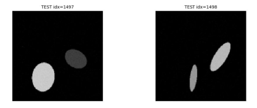
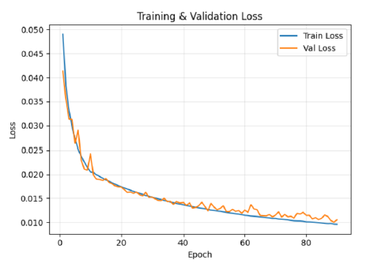
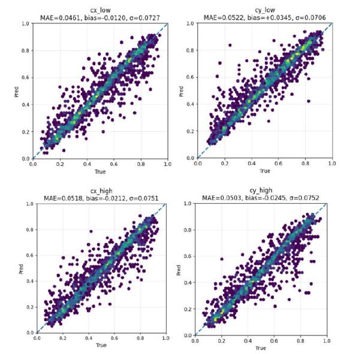
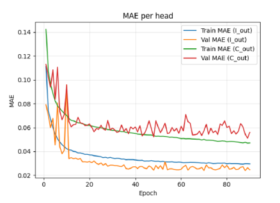
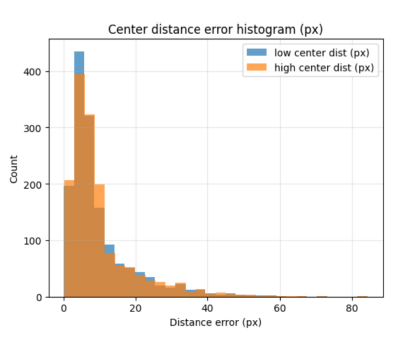

Thesis-related implementation repositories. This project uses TensorFlow/Keras to train a convolutional neural network on synthetic grayscale images containing two elliptical regions. The model predicts the intensity values and spatial center coordinates of the two regions. The pipeline includes synthetic data generation, noise simulation, two-phase training, regression evaluation, residual analysis, and visualization of prediction accuracy.

## Results

### Synthetic image examples

### Training and validation loss

### Prediction performance

### Mean squared error per output

### Center distance error distribution

